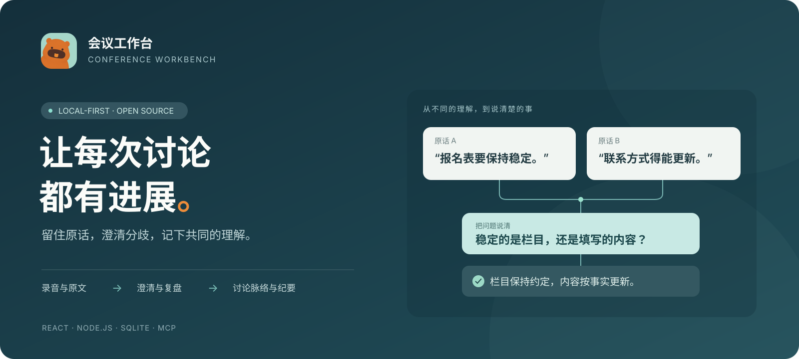
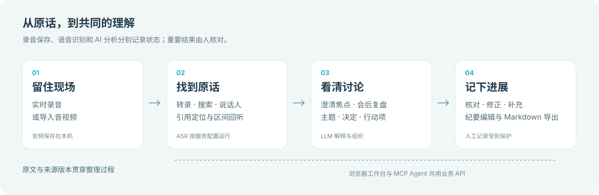
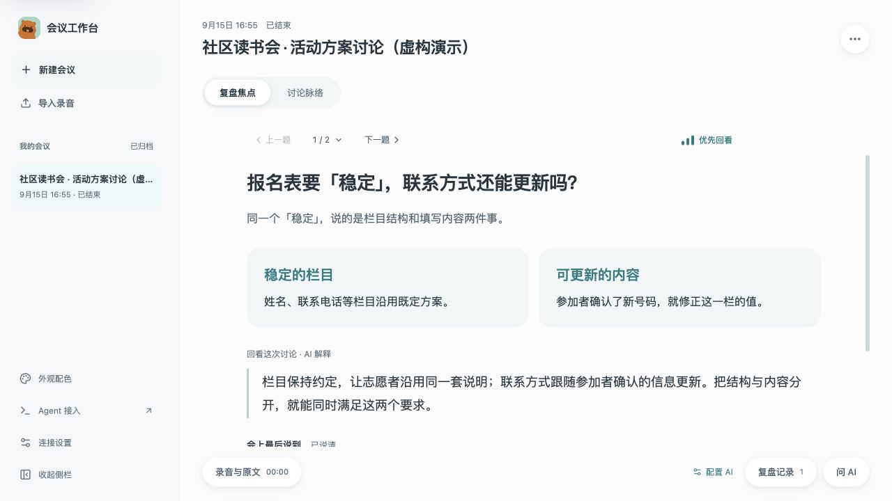
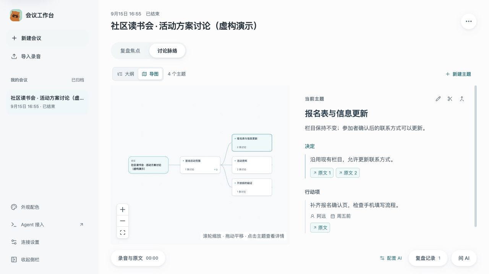
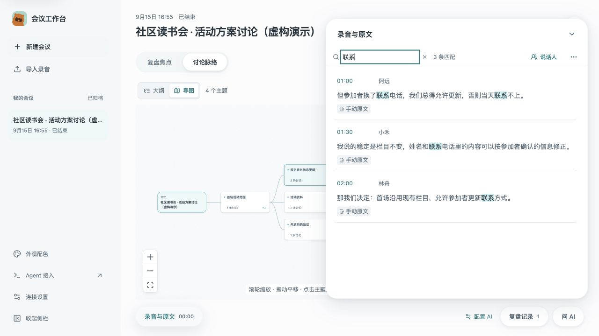

# 会议工作台

**留住原话，澄清分歧，让每次讨论都有进展。**

会议工作台是一个本地优先的 AI 会议辅助工具，适合产品讨论、技术方案评审和会后复盘。主持人在自己的电脑上录音或导入已有录音，工作台围绕原话整理主题、解释概念与前提、记录决定和待办。其他参会者通过投屏或共享窗口观看。

[快速开始](#快速开始) · [功能预览](#功能预览) · [上手指南](docs/GETTING_STARTED.md) · [参与贡献](CONTRIBUTING.md) · [Apache-2.0](LICENSE)

## 能做什么

| 会议中的需要 | 工作台怎样帮助 |
| --- | --- |
| 留下可核对的依据 | 实时录音与转录、导入音视频、原文搜索、引用定位和区间回听 |
| 找到讨论卡在哪里 | 会中澄清焦点、会后复盘焦点，区分词义、隐含前提和取舍标准 |
| 看清讨论走到了哪一步 | 用大纲或导图组织主题，在详情中查看观点、问题、决定和行动项 |
| 记下进展，保留不同意见 | 记录「已经说清楚」「还需要验证」「还有不同意见」，人工修正受到保护 |
| 核对谁说了什么 | 手动标记与合并说话人、关联团队成员；可选安装本地声纹模型 |
| 会后继续工作 | 编辑和导出 Markdown 纪要，通过 MCP 与 Skill 让 Agent 读取、整理、写回会议 |



## 功能预览

以下均为运行中的真实界面截图，使用 `npm run demo` 创建的**虚构会议和预置分析内容**。截图用于说明交互，不代表语音识别或模型分析的实测效果。

### 先弄清楚大家说的是不是同一件事

焦点页解释一个值得讨论的问题，把容易混淆的含义展开。会后复盘也会保留已经说清、但值得记住的误解；原话与引用按需查看。



### 让讨论脉络和结论放在一起

大纲与导图共用同一组主题。选择主题后，查看概述、决定、行动项及其原文依据。



### 从整理结果回到原话

原文可以搜索、修正和标记说话人。有对应录音时，点击引用可定位回听；演示数据不包含音频。



## 快速开始

需要 **Node.js 22.13+** 和 npm。导入音视频及运行完整测试还需要 **ffmpeg**；macOS 可用 `brew install ffmpeg` 安装。Windows 配置见[上手指南](docs/GETTING_STARTED.md#1-准备环境)。

下载源码并解压，或克隆仓库后，在包含 `package.json` 的目录执行：

```sh
npm ci
npm run build
npm start
```

打开 **[http://127.0.0.1:8797](http://127.0.0.1:8797)**。保持终端运行；按 `Ctrl+C` 停止。没有模型密钥也能打开界面、创建会议和保存人工记录。

### 先看一个完整例子

安装依赖并构建后执行：

```sh
npm run demo
```

打开终端显示的 **[演示地址](http://127.0.0.1:8798)**。演示预置主题、复盘焦点、原文与纪要，不需要配置服务。每次启动都创建独立临时数据，不读取正式会议或 `.env`；使用完按 `Ctrl+C` 退出。[演示与截图说明](docs/SCREENSHOTS.md)

### 配置实际使用的服务

在侧栏「连接设置」中分别配置语音识别与大模型，也可以参考 [`.env.example`](.env.example)。

| 用途 | 服务 |
| --- | --- |
| 实时语音识别（ASR） | 火山引擎流式 ASR |
| 导入录音转文字 | 默认火山引擎录音文件识别极速版；可切换兼容 `/v1/audio/transcriptions` 的服务 |
| 主题、澄清、问答、纪要 | 兼容 OpenAI Chat Completions 的大模型服务 |
| 可选：跨会议识别团队说话人 | [本地声纹模型](docs/VOICEPRINT_RUNTIME.md) |

实时 ASR 与火山文件 ASR 共用凭证，但使用不同服务资源，需要分别开通。转录服务与大模型独立配置，项目不附带账户或模型额度。完整步骤见[服务配置](docs/GETTING_STARTED.md#3-按用途配置服务)。

## 数据与使用边界

- **本机、单主持人使用**：服务绑定回环地址，不提供多人登录、远程协作或公网部署入口。
- **本地保存不等于全部离线**：会议、录音、设置和密钥默认存于 `data/`。使用远程 ASR 时会发送音频，使用远程 LLM 时会发送相关转录及上下文；数据处理方式取决于所配置的服务。
- **结果需要核对**：录音保存、转录完成和 AI 整理是独立状态。概念解释、说话人识别与决定提取都可能出错，关键结论应回到原话确认。
- **当前导图展示主题层级**：支持主题及父子关系；尚不自动展示跨主题的前提依赖和因果关系。
- **平台验证有边界**：已有 macOS 使用记录；Windows 的完整录音、导入和系统声音流程尚未实机验收。系统声音采集取决于浏览器与操作系统支持。

`data/`、`.env`、录音、数据库和本地测试产物已加入 Git 忽略规则。分享截图、日志和导出纪要前仍需核对内容。详见[数据与备份](docs/GETTING_STARTED.md#数据与备份)与[安全说明](SECURITY.md)。

## Agent 接入

项目提供 stdio **MCP（Model Context Protocol）** 服务和 `meeting-workbench` Skill。页面与 Agent 共用同一套业务 API；Agent 可以读取会议、搜索原文、提交整理任务和保存纪要。

先启动工作台，再为支持 stdio MCP 的本地 Agent 添加以下连接参数：

```json
{
  "command": "node",
  "args": ["/path/to/conference_workbench/mcp/server.mjs"],
  "env": { "WORKBENCH_URL": "http://127.0.0.1:8797" }
}
```

将路径替换为实际项目位置。Skill 安装、录音控制和写回核对见 [Agent 接入指南](docs/GETTING_STARTED.md#agent-接入)。

## 开发与贡献

```sh
npm run dev            # 前端 5187，API 8797
npm run release:check  # 语法检查、自动测试、前端构建
```

开发前先停止占用相同端口的项目服务。自动测试使用独立临时数据和模拟 ASR / LLM；通过测试不代表真实会议效果通过。CI 使用 Node.js 22 和 24，执行同一套检查。

```text
src/        React 界面与浏览器音频采集
server/     Express API、SQLite 存储、ASR / LLM 与声纹服务
shared/     前后端共用的数据与展示规则
mcp/        stdio MCP 服务
skills/     Agent 操作流程
scripts/    检查、演示与本地评估工具
test/      自动测试与虚构案例
docs/      使用说明、设计约定与图片
```

| 想了解什么 | 文档 |
| --- | --- |
| 安装、服务配置和故障排查 | [上手指南](docs/GETTING_STARTED.md) |
| 提交 Issue / PR，运行验证 | [贡献指南](CONTRIBUTING.md) · [验证与试用](docs/VALIDATION.md) |
| 提示词与效果对比 | [提示词说明](docs/PROMPTS.md) · [合成案例回放](test/fixtures/clarification-cases.md) |
| 界面设计与配色 | [交互设计](docs/INTERACTION_DESIGN.md) · [主题配色](docs/THEME.md) |
| 数据模型、接口和来源校验 | [实现约定](docs/IMPLEMENTATION_CONTRACT.md) |
| 复现 README 截图 | [演示与图片](docs/SCREENSHOTS.md) |

## 许可证与致谢

本项目采用 [Apache License 2.0](LICENSE)。代码来源说明见 [NOTICE.md](NOTICE.md)。

主题持续组织的思路借鉴 [Stanford Co-STORM](https://github.com/stanford-oval/storm)；音频处理与火山引擎协议适配参考、改编自 [interview-workbench](https://github.com/snowshadow/interview-workbench)。
